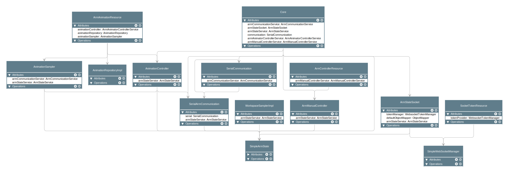
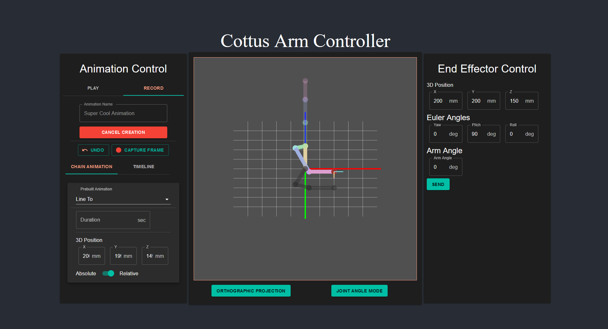

[](https://discord.gg/jazH8eeF4x)

# BachelorProject - MDF/Stepper OpenSource Robotic Arm


## Table of Content

1. [Building Prerequisites](#building-prerequisites) : Material and electronic components needed to build the arm
   1. [Electronics](#electronics)
   2. [Mechanical Pieces](#mechanical-pieces)
   3. [Raw Material](#raw-material)
2. [Assembly Instructions](#assembly-instructions) : Step-by-step instructions to build the arm
3. [Control Software](#control-software--cottus-arm-controller) : Download instructions for a basic software to control the arm
   1. [Download Instructions](#download-instructions) : Download instructions
   2. [Code Architecture Documentation](#developer-instructions): General description of the software's architecture
      1. [Server](#server) : The server side of the software
      2. [Client](#client) : The client side of the software
4. [Scholar Papers](#scholar-papers): The scholar papers that were useful to this project

## Building Prerequisites

### Electronics

#### Raspberry Pi
- user: `cottus-pi`
- pass: `cottus-pi-s3cur3`

### Mechanical Pieces

#### 3D Printing

Pieces that should be 3D printed can be found as `.stl` files in the [Prints](./Prints) directory

#### Laser Cutting

Pieces that should be laser cut can be found as `.dxf` files in the [Prints](./Prints) directory.
6mm thick MDF should be used for all laser cut parts. They are named according to the referential of 
the arm's model in Fusion360

#### Screws
- [x16] : M4*12mm > Nema 17 Stepper Upper connection
- [x12] : M3*20mm > Nema 17 to Gearbox Adapter Connection
  - You might not need these
- 

### Raw Material

- [x3] : Aluminium/Metallic axle : 8mm in diameter
- [x1] : Wood glue stick for MDF assembly

## Assembly Instructions

The Fusion 360 file of the entire arm that you can import can be found [here](./Resources/Robotic%20Arm%20v110.step). It
contains all the 3D pieces and sketches resulting in the `.stl` and `.dxf` files you can find in the [Prints](./Prints) directory

## Control Software : Cottus Arm Controller

### Download Instructions


### Developer Instructions

#### General Architecture
The arm's controller hosts a server which the software's web client connects to in order to control it.
The server opens a serial connection on startup to communicate to the Arduino Mega via predefined packets :
- From PI to Arduino : Target angles (In degrees)
- From Arduino to PI : Motor speed (At startup, in deg/sec) and Current angles position (In loop, in degrees)

#### Server

##### Framework used :
The framework chosen to code the backend of the application is **Quarkus**. It is a recent
framework resembling Spring Boot. It has a well documented API that I invite you to [check
here](https://quarkus.io/). 

Several libraries act on top of this layer :
- [jSerialComm](https://github.com/Fazecast/jSerialComm) : Communicates with the Arduino Mega using the Serial connection
- [Efficient Java Matrix Library (ejml)](https://github.com/lessthanoptimal/ejml) : Matrix multiplications and other operations
- Quarkus-based :
  - [Rest-easy-Reactive-Jackson](https://quarkus.io/guides/rest-json) : Serialization of objects and [Reactive](https://quarkus.io/guides/getting-started-reactive) endpoints
  - [Websocket](https://quarkus.io/guides/websockets) : Communication with client using websockets
  - [Mongo DB with Panache](https://quarkus.io/guides/mongodb-panache) : Stores objects (animations) in Mongo Database with the Panache abstraction layer 

[Docker Compose](https://docs.docker.com/compose/) is used to set up the services of this project (server and database)
using the [docker-compose.yml file](./Software/cottus-controller/docker-compose.yml).

Docker-compose can be installed on Windows
easily with [Chocolatey](https://docs.chocolatey.org/en-us/choco/setup), adding the `C:\ProgramData\chocolatey\lib` path to the `Path` System
environment variable.

#### Architecture :
```
src/java/packagename/
   ⎿ dto
   ⎿ exception
   ⎿ models
   ⎿ repositories
   ⎿ resources
   ⎿ security
   ⎿ services
   ⎿ utils
```
##### dto
Objects sent by Quarkus as a response to an HTTP request are serialized by the 
Jackson library. They are decomposed into basic types to the JSON format. 
In order to facilitate this process and agree with the frontend to a common representation
of the objects travelling over the network, we use the DTO (Data Transfer Objects) layer.

As such, each object is re-declared in this layer and made serializable for the Jackson
library. The exact same definition of the DTOs can be found on the frontend's side. 
Only fields interesting to the other side of the network should be specified on this layer,
as the rest of them are not relevant and may often constitute abstraction leaks.

##### exception
This directory holds all the custom exceptions for the application

##### models
This is the only directory (along with `utils` to some extent) that should hold the implementation
details of the model behind your application (also referred as "business logic"). 

In our case, it holds all the computation for the control of the arm. 

##### repositories

Repositories used for persisting objects in the application. In our case, we have
a Mongo service running in a docker container

For now, only animations are saved to the database

##### resources
The `resources` directory declares all the endpoints reachable by the frontend. Handling
of all types of HTTP requests (`GET`, `POST`, ...) is implemented here even though it can
be mostly summed up to forwarding the calls to the `services` layer.

##### security
This directory handles the security logic of the application, which currently isn't much.

For now, it simply checks that a client trying to establish a connection to websocket does
so with a valid token that it previously got from an HTTP request to the server.

##### utils
Everything that isn't really proper to the business logic goes here. That includes
things like implementation of mathematical concepts like Vector3D...

##### Dependency Graph


#### Client



##### Framework used :
The framework chosen to code the frontend of the application
is [React](https://reactjs.org/) with a layer of [TypeScript](https://www.typescriptlang.org/)
on top to enforce types and have a cleaner code with improved auto-completion from the IDE.

The React code also uses the [Material UI](https://mui.com/material-ui/getting-started/overview/)
library to have nice-looking components out of the box.

##### Architecture :
A description of the principles of the architecture used can be found [here](https://paulallies.medium.com/clean-architecture-typescript-and-react-8e509098abfe)

## Scholar Papers:
Papers that I read fully or just in diagonal in the format (Only most relevant papers read are listed here) :
`<Relevance/How much it was used>/5 - Name : [Desciption/Note]`

- `3/5` - [Design and Implementation of a 6-DOF Intelligent Single-arm](Resources/Papers/25883917.pdf) : Learn the existence of Denavite-Hartenberg parameters and tables
- `5/5` - [Solution of Inverse Kinematics for 6R Robot Manipulators With Offset Wrist Based on Geometric Algebra](Resources/Papers/jmr_005_03_031010.pdf)
- `3/5` - [Introduction to Inverse Kinematics](Resources/Papers/iksurvey.pdf) : List of different methods for 
solving inverse kinematics numerically
- `5/5` - [Analytical Inverse Kinematic Computation for
  7-DOF Redundant Manipulators With Joint Limits
  and Its Application to Redundancy Resolution](Resources/Papers/Analytical_Inverse_Kinematic_Computation_for_7-DOF_Redundant_Manipulators_With_Joint_Limits_and_Its_Application_to_Redundancy_Resolution.pdf)
: Complete solution for analytical Inverse Kinematics
- `4/5` - [An Analytical Solution for Inverse Kinematics of
  7-DOF Redundant Manipulators with Offsets at
  Elbow and Wrist](Resources/Papers/An_Analytical_Solution_to_Inverse_Kinematics_of_Seven_Degree-of-freedom_Redundant_Manipulator.pdf) : Helped 
understand the previous paper
